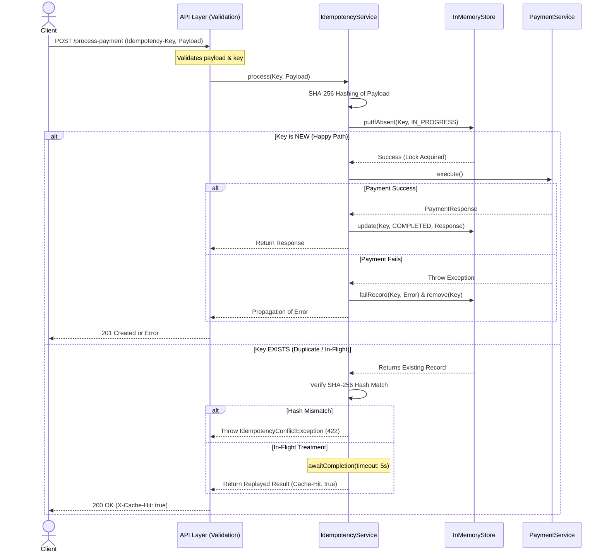

# FinSafe Idempotency Gateway (The "Pay-Once" Protocol)

This repository contains an enterprise-grade backend implementation of an Idempotency Layer for FinSafe Transactions Ltd. It ensures that network retries do not result in double-charging customers, even under high concurrency and failure scenarios.

##  Architecture & Resilience Logic

This implementation goes beyond basic idempotency by handling race conditions, wait timeouts, and failure scenarios.



##  Setup & Execution

### Prerequisites
- Java 17+
- Maven 3.8+

### Run the Application
```bash
mvn spring-boot:run
```
The server starts on `http://localhost:8080`.

### Run Tests
```bash
mvn test
```

---

##  API Documentation

### `POST /process-payment`

Processes a simulated payment with idempotency guarantees.

**Headers**

| Header | Type | Required | Description |
|---|---|---|---|
| `Idempotency-Key` | string | ✅ Yes | Unique key per payment attempt |
| `Content-Type` | string | ✅ Yes | Must be `application/json` |

**Request Body**

| Field | Type | Validation |
|---|---|---|
| `amount` | integer | Must be positive |
| `currency` | string | Must not be blank |

---

### Example 1 — First Request (Happy Path)

```bash
curl -X POST http://localhost:8080/process-payment \
  -H "Content-Type: application/json" \
  -H "Idempotency-Key: pay-order-abc-001" \
  -d '{"amount": 100, "currency": "GHS"}'
```

**Response — `201 Created`**
```json
{"status": "Charged 100 GHS"}
```

---

### Example 2 — Duplicate Request (Same Key, Same Body)

```bash
curl -X POST http://localhost:8080/process-payment \
  -H "Content-Type: application/json" \
  -H "Idempotency-Key: pay-order-abc-001" \
  -d '{"amount": 100, "currency": "GHS"}'
```

**Response — `200 OK`** (with header `X-Cache-Hit: true`, no processing delay)
```json
{"status": "Charged 100 GHS"}
```

---

### Example 3 — Conflict (Same Key, Different Body)

```bash
curl -X POST http://localhost:8080/process-payment \
  -H "Content-Type: application/json" \
  -H "Idempotency-Key: pay-order-abc-001" \
  -d '{"amount": 500, "currency": "GHS"}'
```

**Response — `422 Unprocessable Entity`**
```json
{"error": "Idempotency key already used for a different request body."}
```

---

### Example 4 — Validation Error (Missing Header)

```bash
curl -X POST http://localhost:8080/process-payment \
  -H "Content-Type: application/json" \
  -d '{"amount": 100, "currency": "GHS"}'
```

**Response — `400 Bad Request`**
```json
{"error": "Required header missing: Idempotency-Key"}
```

---

##  Enterprise Design Decisions

- **Resilience (Failure Cleanup)**: If payment processing fails, the record is immediately removed from cache, allowing the client to retry safely without deadlocking.
- **Safety (Wait Timeouts)**: A 5-second `await()` timeout on in-flight requests prevents thread starvation if the primary processing thread hangs indefinitely.
- **Integrity (SHA-256 Hashing)**: Replaced naive `hashCode()` with SHA-256 payload hashing for collision resistance and consistency across distributed environments.
- **Observability**: SLF4J structured logging on every cache hit, miss, conflict, and timeout for operational visibility.


##  The Developer's Choice: Automated TTL Cache Eviction

**Feature Added**: Scheduled background cache sweeper.

**Rationale**: In a production fintech gateway, storing idempotency keys indefinitely is a memory leak and a compliance risk. Payment retries typically happen within seconds or minutes of the original attempt — not days.

**Implementation**: A `@Scheduled` background task runs every hour and evicts all records older than 24 hours, keeping memory usage stable over time without manual intervention.

> **Production Note**: For a horizontally scaled deployment, replace `InMemoryIdempotencyRepository` with a distributed store like **Redis**, and use **Redlock** to replicate the `CountDownLatch` in-flight synchronization across nodes.