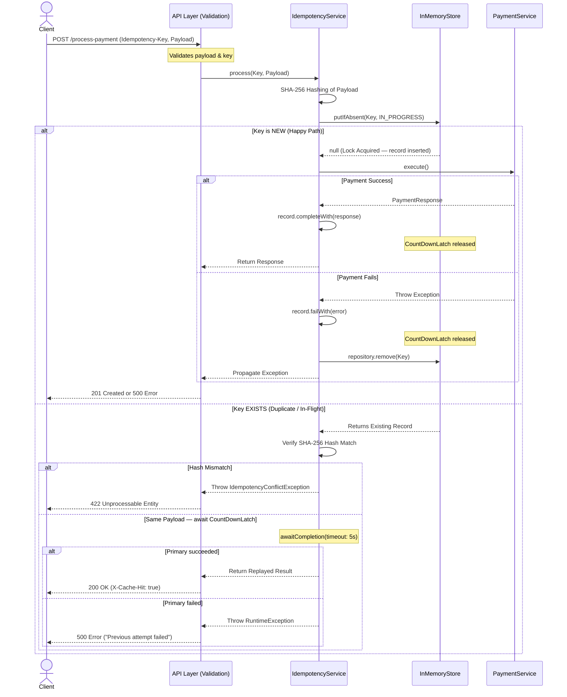

# FinSafe Idempotency Gateway (The "Pay-Once" Protocol)

This repository contains an enterprise-grade backend implementation of an Idempotency Layer for FinSafe Transactions Ltd. It ensures that network retries do not result in double-charging customers, even under high concurrency and failure scenarios.


##  Architecture & Resilience Logic

This implementation goes beyond basic idempotency by handling race conditions, wait timeouts, and failure scenarios.




##  Setup & Execution

### Prerequisites
- Java 17+
- Maven 3.8+

### Run the Application
```bash
mvn spring-boot:run
```
The server starts on `http://localhost:8080`.

### Run Tests
```bash
mvn test
```


##  API Documentation

### `POST /process-payment`

Processes a simulated payment with idempotency guarantees.

**Headers**

| Header | Type | Required | Description |
|---|---|---|---|
| `Idempotency-Key` | string | ✅ Yes | Unique key per payment attempt |
| `Content-Type` | string | ✅ Yes | Must be `application/json` |

**Request Body**

| Field | Type | Validation |
|---|---|---|
| `amount` | integer | Must be a positive integer |
| `currency` | string | Must not be blank |

**Response Body**

| Scenario | Status | Body Schema |
|---|---|---|
| New payment processed | `201 Created` | `{ "status": "Charged 100 GHS" }` |
| Duplicate request replayed | `200 OK` | `{ "status": "Charged 100 GHS" }` |
| Payload mismatch on existing key | `422 Unprocessable Entity` | `{ "error": "Idempotency key already used for a different request body." }` |
| Missing or invalid fields | `400 Bad Request` | `{ "error": "<field>: <validation message>" }` |
| Missing Idempotency-Key header | `400 Bad Request` | `{ "error": "Required header missing: Idempotency-Key" }` |

**Response Headers**

| Header | Value | When present |
|---|---|---|
| `X-Cache-Hit` | `true` | Only on replayed (cached) responses |


### Example 1 — First Request (Happy Path)

```bash
curl -X POST http://localhost:8080/process-payment \
  -H "Content-Type: application/json" \
  -H "Idempotency-Key: pay-order-abc-001" \
  -d '{"amount": 100, "currency": "GHS"}'
```

**Response — `201 Created`**
```json
{"status": "Charged 100 GHS"}
```


### Example 2 — Duplicate Request (Same Key, Same Body)

```bash
curl -X POST http://localhost:8080/process-payment \
  -H "Content-Type: application/json" \
  -H "Idempotency-Key: pay-order-abc-001" \
  -d '{"amount": 100, "currency": "GHS"}'
```

**Response — `200 OK`** with response header `X-Cache-Hit: true` and no 2-second processing delay.
```json
{"status": "Charged 100 GHS"}
```


### Example 3 — Conflict (Same Key, Different Body)

```bash
curl -X POST http://localhost:8080/process-payment \
  -H "Content-Type: application/json" \
  -H "Idempotency-Key: pay-order-abc-001" \
  -d '{"amount": 500, "currency": "GHS"}'
```

**Response — `422 Unprocessable Entity`**
```json
{"error": "Idempotency key already used for a different request body."}
```


### Example 4 — Missing Header

```bash
curl -X POST http://localhost:8080/process-payment \
  -H "Content-Type: application/json" \
  -d '{"amount": 100, "currency": "GHS"}'
```

**Response — `400 Bad Request`**
```json
{"error": "Required header missing: Idempotency-Key"}
```


##  Enterprise Design Decisions

- **Thread Safety (`ConcurrentHashMap` + `putIfAbsent`)**: The store uses a `ConcurrentHashMap`. The `putIfAbsent` operation is atomic — it guarantees that even if ten threads arrive simultaneously with the same key, exactly one will insert and become the primary processor. All others will receive the existing record and wait.

- **In-Flight Synchronization (`CountDownLatch`)**: Each `IdempotencyRecord` holds a `CountDownLatch(1)`. When the primary request finishes (success or failure), it calls `countDown()`, releasing all waiting duplicate threads simultaneously. This is what prevents duplicate threads from polling or busy-waiting.

- **Failure Propagation**: If the primary request fails, the record is marked via `record.failWith(error)` which releases the latch, and then immediately removed from the cache via `repository.remove(key)`. Waiting duplicate threads receive a `RuntimeException` with the message `"Previous attempt failed: ..."`. Removing the record allows the client to retry cleanly with the same key.

- **Wait Timeout**: Duplicate threads call `awaitCompletion(5, TimeUnit.SECONDS)`. If the primary thread hangs beyond 5 seconds, waiting threads receive a gateway timeout error rather than blocking indefinitely, preventing thread starvation.

- **Payload Integrity (SHA-256)**: The request payload is hashed with SHA-256 rather than Java's native `hashCode()`. SHA-256 has negligible collision probability and produces consistent output regardless of JVM version or runtime, which is essential for distributed deployments.

- **Observability**: SLF4J structured logging on every cache hit, miss, conflict, timeout, and failure for operational visibility.

---

##  The Developer's Choice: Automated TTL Cache Eviction

**Feature Added**: Scheduled background cache sweeper using `@Scheduled(fixedRate = 3600000)`.

**Rationale**: In a production fintech gateway, storing idempotency keys indefinitely is a memory leak and a compliance risk. Payment retries typically happen within seconds or minutes of the original attempt. There is no reason to retain a key for days.

**Implementation**: A `@Scheduled` task runs every hour (`fixedRate = 3600000ms`) and evicts all records whose timestamp is older than 24 hours. This keeps memory usage stable over time without manual intervention or an external TTL store.

**`fixedRate` vs `fixedDelay`**: This implementation uses `fixedRate`, meaning the eviction sweep is triggered every hour from the last *start time*, not from the last *completion time*. For a lightweight in-memory sweep this is the correct choice — eviction runs on a predictable schedule regardless of how long the sweep itself takes.

---

##  Test Coverage

### `GatewayApplicationTests`
Smoke test that verifies the full Spring application context loads without errors.

### `IdempotencyConcurrencyTest`

**`testConcurrentRequests_SameKey_ExactlyOneProcessing`**
Fires 10 threads simultaneously with the same idempotency key and payload. Asserts that `PaymentService.execute()` is called exactly once via Mockito verification, and that all 10 threads receive the correct response. Also asserts that exactly 9 of the 10 results carry `isCacheHit = true`.

**`testConcurrentRequests_SameKey_FailureHandling`**
Fires 5 threads simultaneously where the payment provider is mocked to throw a `RuntimeException`. Asserts that `PaymentService.execute()` is called exactly once, and that all 5 threads receive an error message containing `"Payment Provider Down"` — proving that failure is propagated correctly to waiting threads and that the failed record is cleaned up.

---

> **Production Note**: For a horizontally scaled deployment, replace `InMemoryIdempotencyRepository` with a distributed store like **Redis**, and use **Redlock** to replicate the `CountDownLatch` in-flight synchronization across nodes.